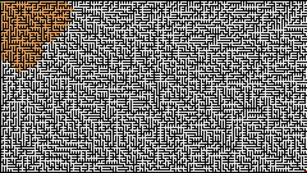
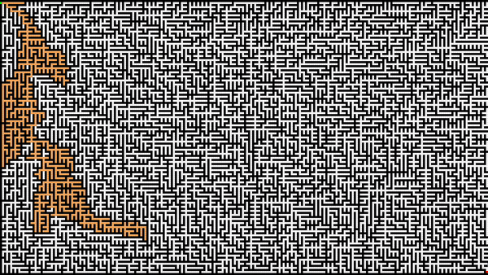

# Maze Game with Pathfinding Algorithm Visualization

Maze Game is a simple game in which you find the shortest path to the goal within a maze. This repository also includes a visualization of the pathfinding process, allowing for easy tracking and understanding of the algorithm's workings.

## Demo

### BFS



### DFS




## Features
* Random maze generation with various sizes
Real-time visualization of the shortest pathfinding algorithm
* Support for different search algorithms, such as BFS, DFS, A*, and Dijkstra
* Ability to control the character to solve the maze manually

## Requirements

* pygame==2.4.0

## Installation

1. Clone this repository on your local machine
```bash
git clone https://github.com/adrolc/pathfinding-visualizer
```
1. Navigate to the repository folder
```bash
cd pathfinding-visualizer
```
1. Install the required libraries
```bash
pip install -r requirements.txt
```

## How to Run

1. Launch the game by typing in the terminal:

```bash
python main.py
```